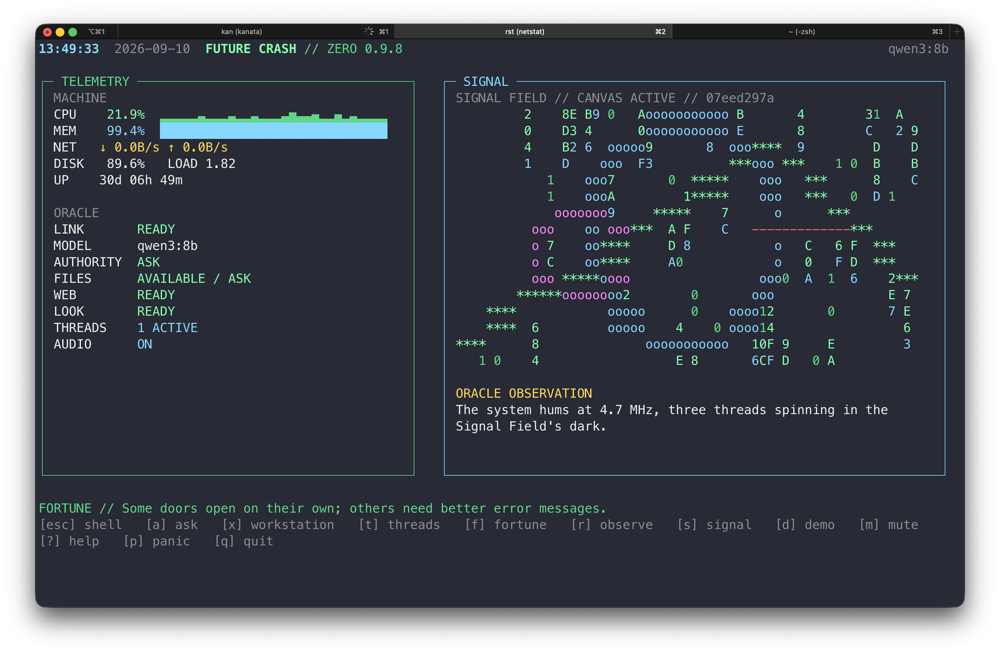
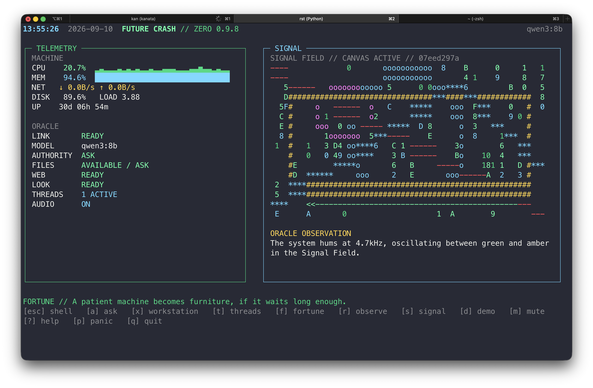
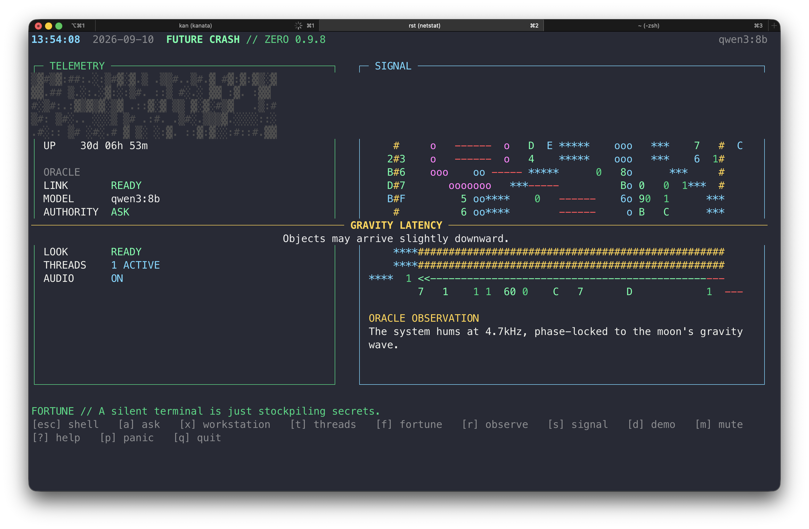
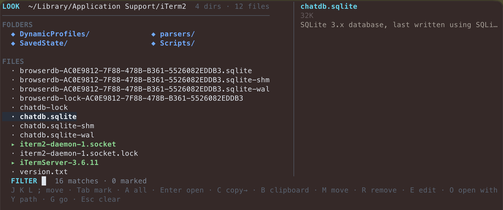
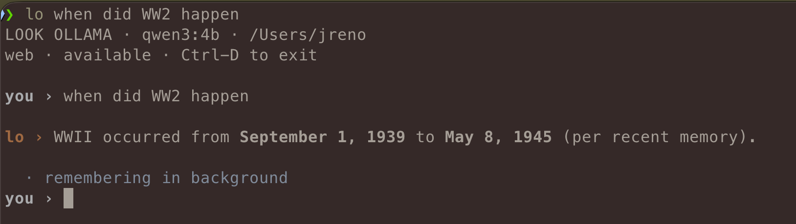
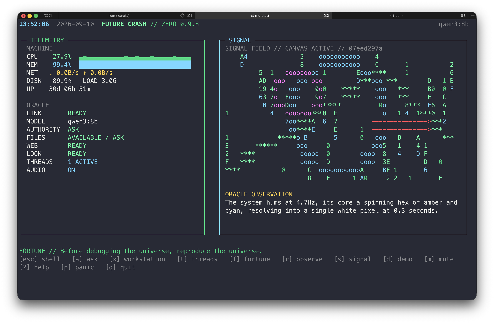
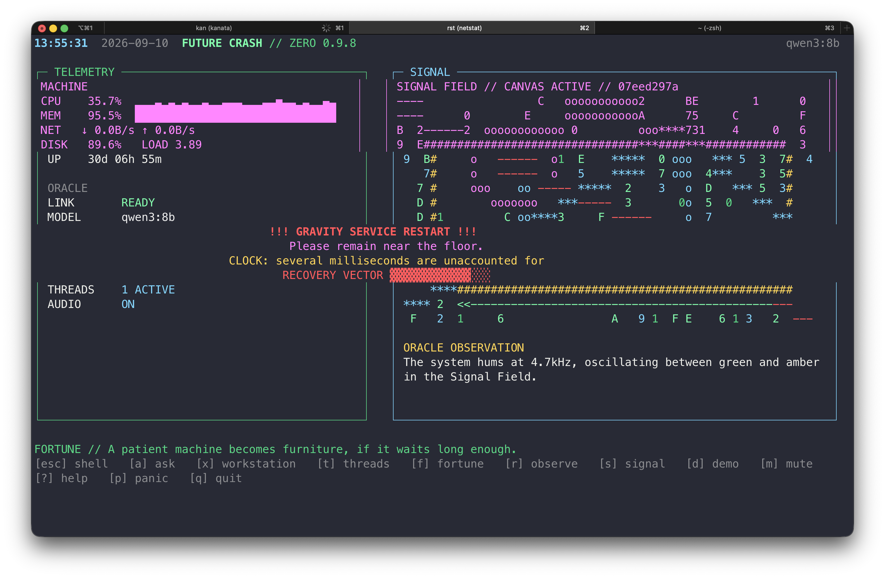
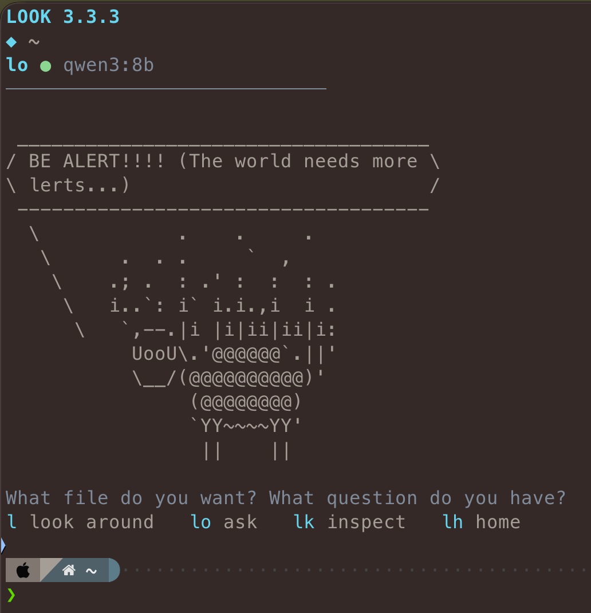
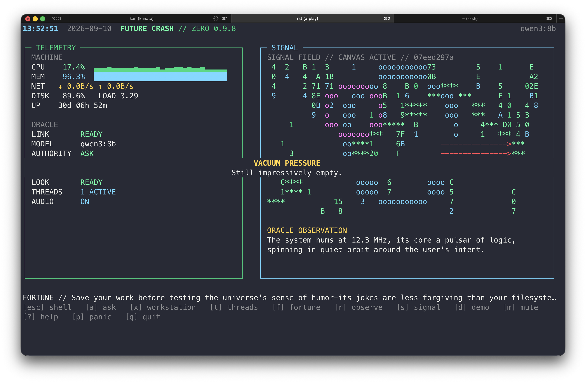

# FUTURE CRASH + LOOK

**A local-first AI terminal environment for macOS and Linux.**



Future Crash is the place you inhabit. **LOOK is the machinery underneath it.**

Future Crash gives a local language model a playful terminal front end. LOOK gives the terminal underneath it a compact language for navigation, files, machine inspection, Ollama, remote models, memory, learned skills, and controlled agentic work.

They started as separate projects. They now install and live as one system.

---


## LOOK 2.0: your LOOK is portable

LOOK now treats your evolving local AI as a first-class **profile**, separate from the software package and from disposable machine/runtime state.

```text
lk profile
lk profile backup ~/Documents/LOOK
lk profile export
lk profile restore look-profile-....zip
```

Memory, recent continuity, core customization, learned skills, personalities, behavioral preferences, and feedback settings travel. Secrets, undo/trash, jobs/events, worker queues, PIDs, caches, and machine-specific host plumbing do not.

For presentation preferences:

```text
lk feedback
lk sound
```

Sound is off by default; motion is subtle by default. Both degrade to nothing for piped output.


## Filer → LO context

LOOK's filer can hand its current working set directly to LO.

1. Filter/select files normally.
2. Mark any number with `Tab` or `A` (or leave one highlighted).
3. Press **`L`**.

LO opens immediately with those paths named as the selected context:

```text
context · 6 selected paths
you ›
```

The files are **not** blindly stuffed into the model context. LO receives their paths and uses its normal bounded `read_file`, `list_files`, `search_files`, and mutation tools only when the request requires them. The LO workspace is rooted at the nearest common selected directory, so the handed-off paths are actually accessible to the session.


## LO execution receipts

LO distinguishes **planning** from **execution**. For explicit filesystem changes, LOOK will not accept a prose-only success claim: an actual mutation tool must run first. Several new text files should use the bounded batch creator; routine process/port diagnosis uses read-only host inspection tools even in Workspace mode.

Workspace remains bounded: it can inspect the host and mutate files inside the starting workspace, but arbitrary shell commands still require Power or Unsafe mode.


## LO continuity

LO keeps three deliberately different memory layers:

- **Recent conversation:** a small literal cross-session ring. This is what lets a fresh `lo` session understand “what happened to those files?” from a recent exchange.
- **Candidate memory:** semantic facts/project state with importance scores. Unreinforced candidates decay; zero means forgotten.
- **Long-term:** a compact background summary periodically consolidated from candidates that remain strong or are reinforced.

`lk memory` shows all three states. `lk memory clear-recent` clears only recent literal conversation.

For filesystem work, LO can create several new text files in one bounded operation rather than spending one model/tool round per file. Direct shell helpers also accept batches:

```text
lcp a.txt b.txt archive/
lmv one.md two.md notes/
lrm old1.txt old2.txt
```

Copy/move batches use the existing LOOK undo transaction machinery.


## Starter toolkit

You can use all of LOOK while remembering only a few entrances:

```text
lk system    machine health, processes, ports
lk ai        models, benchmark, thinking, personality
lk net       addresses, Tailscale, sharing, web readiness
lk clean     conservative maintenance
lk config    LOOK and LO behavior

lo           talk to LO
fc           Future Crash
```

These are keyboard-driven control surfaces over the existing commands, not replacements. Experienced users can still go directly to `lk doctor`, `lk models`, `lk thinking deep`, `lk tailscale`, and the rest.

Use `lk commands` for the terse vocabulary index and `lk help all` for the complete command/key glossary.


## Install

Installation happens in Terminal, but it is intentionally simple.

### 1. Download and unzip the release

Open Terminal. Type `cd ` — including the space — then drag the unzipped `future-crash-look-1.3.0` folder into the Terminal window and press Return.

Or navigate there normally:

```sh
cd ~/Downloads/future-crash-look-1.3.0
```

### 2. Give the installer permission to run

```sh
chmod +x install.sh
```

`chmod +x` simply marks the installer as executable. You normally do this once for a downloaded release.

### 3. Run it

```sh
./install.sh
```

The installer sets up Future Crash + LOOK, the shell integration, LOOK's command-line tools, documentation, and the optional terminal experience. It may also offer supporting software such as Tailscale or Ollama when they are not already present.

When it finishes:

```sh
exec zsh
future-crash
```

That is the front door.


The installer is rerunnable. A newer release updates the files the project owns; the same release reconciles them. Version-aware installers refuse to overwrite a newer release unless you deliberately use `--force-downgrade`.

---

## The idea in thirty seconds

There are three pieces:

```text
Future Crash   the experience
      ↓
LOOK           the terminal language and tools
      ↓
LO             the working local/remote AI
      ↓
Unix + Ollama  ordinary files, processes, models, network
```

You can live almost entirely in Future Crash, drop into LOOK when you want the underlying machine, or use LO directly when you want the AI without the Future Crash front end.



### Future Crash

Launch it with:

```sh
future-crash
```

or the shorter aliases:

```sh
fc
rst
```

Future Crash is conversational and ambient: observations, fortunes, system context, AI conversation, and the sense that the terminal itself has a personality.

Press `Esc` to expose the shell underneath. Type:

```sh
exit
```

to return to the same Future Crash session.

Nested Future Crash sessions are blocked by default so you do not accidentally end up six shells deep.



### LO information edges

LO has a deliberately small set of canonical read-only sources before generic web search:

- `weather` — live current conditions and short forecast via Open-Meteo; no key required.
- `place_lookup` — place-name/postal-code resolution to coordinates and timezone via Open-Meteo.
- `wikipedia` — compact English Wikipedia article search for stable encyclopedic background.
- `web_search` — Ollama-hosted generic search for current/open-ended material when `OLLAMA_API_KEY` is configured.

The model chooses the appropriate edge. Retrieval is visible in the terminal (`weather ›`, `place ›`, `wiki ›`, `search ›`) and the returned data is compact so it does not flood the local model's context.

## LOOK

LOOK is the practical layer underneath Future Crash:

```sh
lk
```

It handles navigation, fuzzy finding, filtering, file inspection, system information, Ollama hosts and models, settings, memory, skills, and other small pieces of the machine.

A few useful starting points:

```sh
l
lr
lz
f
lk machine
lk doctor
lk settings
```



### LO

LO is LOOK's direct AI interface:

```sh
lo
```

It is conversation-first. File tools are available, but LO does not search the workspace merely because a tool exists. Casual conversation stays conversation; file and system tools come into play when the request actually calls for them.

```sh
lo
lo search
lo --conservative
lo --workspace
lo --power
lo --unsafe
```



Future Crash and LO share the same selected Ollama model and host.

---

## First five minutes

After installation:

```sh
future-crash
```

Explore it for a moment. Press `Esc` to reveal the shell, then try:

```sh
lk
l
lk machine
lo
```

Inside LO, ask something conversational. Then ask it to inspect a file in the current folder. The point is that the same interface can move from ordinary conversation to real local work without pretending those are the same permission.

If you want to see what LO remembers:

```sh
lk memory
```

If you want to see what LO has learned about *doing its job*:

```sh
lk skills
```



---

## AI setup

Future Crash + LOOK does not bundle a language model. It works with **Ollama**.

### Local model

If Ollama is installed on the same machine, pull any model appropriate for the hardware. For example:

```sh
ollama pull qwen3:8b
```

Then inspect or select models with:

```sh
lk ollama models
```

A lighter machine can use a smaller model. A workstation with more memory can use a much larger one.

### Remote model

The interface and the model do not have to run on the same computer.

A laptop can run Future Crash + LOOK while a desktop workstation runs Ollama:

```text
MacBook / Linux laptop
  ├── Future Crash
  └── LOOK / LO
         │
      Tailscale
         │
GPU workstation
  └── Ollama
```

Manage saved hosts with:

```sh
lk ollama host
```

Once a host is selected, Future Crash and LO inherit it automatically.



### Web search

Ollama web search uses an Ollama API key. Configure it once:

```sh
lk ollama key
```

Check the configuration without exposing the key:

```sh
lk ollama key status
```

Web search is optional. LOOK's normal terminal features do not depend on it.

---

## Permission levels

LO separates **intelligence** from **permission**.

| Profile | What LO can do |
| --- | --- |
| **Conservative** | Read/search and reason; no writes |
| **Workspace** | Read and intentionally edit inside the starting workspace |
| **Power** | Workspace tools plus shell commands, confirmed individually |
| **Unsafe** | Unrestricted shell commands with the current user's privileges |

Workspace is the normal working mode. Unsafe is intentionally named.

Change the persistent profile from:

```sh
lk settings
```

or choose a one-session override:

```sh
lo --conservative
lo --workspace
lo --power
lo --unsafe
```

---

## Memory: small, selective, forgetful

LO does not dump a giant transcript into every prompt.

Its live working context is explicitly bounded at 8192 tokens. Core system/workspace context stays fixed while recent conversation is retained under both a message-count and serialized-size budget; older continuity is expected to survive through memory rather than an endlessly growing transcript.

It also keeps a bounded pool of candidate memories and only exposes a small working set to the model. Candidate memories have importance values, decay when they stop mattering, and strengthen when they genuinely prove useful.

```sh
lk memory
```

The design is deliberately simple:

```text
conversation
   ↓
candidate memories
   ↓
decay / reinforcement
   ↓
small working context
   ↓
durable patterns
   ↓
long-term summary
```

Explicit requests such as “remember this long term” can promote information directly into the long-term summary. The summary is not sacred or append-only; it periodically rewrites itself under a fixed size budget so stale, redundant, superseded, or low-value details can disappear.

Memory is stored in human-readable JSON and carries a **schema version**, so future LOOK releases can migrate the data format without treating the contents of your memory as an application version.


---

## Skills: LO's accumulated craft

Memory is about **you**. Skills are about **how LO works**.

LO ships with reviewed bundled skills such as:

- inspect before modifying;
- prefer surgical changes over rewrites;
- preserve unrelated behavior;
- test changes when practical;
- treat user-owned shell configuration conservatively.

LO can also learn generalized techniques from successful work and place them in the `## Learned` section of `skills.md`.

```sh
lk skills
```

You can inspect and edit the file directly, or use:

```sh
lk skills add "Inspect the existing configuration before changing it"
lk skills forget "configuration"
lk skills clear-learned
```

### Skills have their own version

The application and the craft pack are intentionally separate concepts:

```text
Future Crash + LOOK   application release
memory schema         data-format version
skills schema         skills-file format
bundled skills pack   reviewed craft version
```

Check the installed craft pack:

```sh
lk skills version
```

Update the bundled section from the current release while preserving everything LO learned locally:

```sh
lk skills update
```

You can also merge another compatible skills pack:

```sh
lk skills update /path/to/skills.md
```

That means the program can eventually stabilize while the reviewed assistant craft continues to improve independently.

---


## Signal Field as an expressive channel

### Signal wiring fix

Future Crash preserves valid `[[SIGNAL]]` blocks even when an Ollama/Qwen model places them in structured thinking. Reasoning prose remains hidden; the Signal directives still reach the renderer. Workstation and Oracle views also restore a larger roughly half-screen Signal pane on ordinary desktop widths, and the built-in Dream thread has a visual fallback so every successful wake produces visible Signal activity.


Future Crash can now treat Signal as part of its native language rather than a special-case drawing trick.

- Ask and Workstation may use Signal when a visual genuinely improves the answer.
- Signal is explicitly modeled as a **40×12 addressable character framebuffer**. It can work at three levels: semantic primitives (`PLOT`, `BARS`, circles/arrows), vector geometry (`LINE`, `BOX`, `TEXT`), or exact raster composition (`SPRITE`, `PUT`).
- `SPRITE x y color ... END` preserves character-art whitespace; spaces are transparent, so sprites can layer over other Signal content.
- `BARS x baseline_y color ...` turns normalized values into deterministic host-rasterized columns for EQs, meters, spectra, and dashboards.
- Signal renders produce a tiny persistent receipt with modes used, accepted/rejected commands, clipping, nonempty cells, occupied dimensions/bounds, title, and frame count.
- The latest few receipts are fed back to Future Crash so later drawings can improve.
- Signal supports tiny multi-frame animations with `FPS` + `FRAME`.
- The Threads screen has a built-in **Signal Dream** preset: press `D` to toggle a roughly four-minute model-only dream thread.

Signal history is intentionally tiny and bounded. It is craft feedback, not a screenshot archive.

Future Crash memory is still lean, but its recent conversational buffer now keeps eight completed Workstation exchanges before consolidation rather than five, and the long-memory budget is modestly larger. The principle remains the same: keep enough continuity to be useful, then compress.


## Future Crash personality boundary

Future Crash and LO share the same Ollama substrate, but they do **not** share personality selection.

Future Crash owns a fixed application personality in:

```text
~/.local/share/future-crash/personality.md
```

LO remains user-selectable (`lo`, `robot`, `max`, `philosopher`). Switching LO personality therefore does not turn Future Crash into Philosopher or Space Robot.

Short Future Crash artifacts—fortunes, ambient/oracle observations, and similar micro-generations—are **final-only**. Future Crash reserves a fixed three-line Fortune body beneath its `FORTUNE //` label, keeping the ambient layout stable as fortunes wrap. If a model returns only prompt-paraphrase/reasoning instead of a final artifact, Future Crash now fails closed to the local Future Crash seed rather than displaying model internals. Model reasoning is discarded before the text reaches the interface, including Qwen/Ollama template cases where a stray closing `</think>` appears in visible content.

---

## LO personality and thinking

LO now has three independent controls. They deliberately do different jobs:

```text
CAPABILITY    what LO is allowed to do
PERSONALITY   how LO speaks and approaches the interaction
THINKING      how much deliberation and how that work is presented
```

Choose them interactively with `lk settings`, or directly:

```sh
lk personality lo
lk personality robot
lk personality max
lk personality philosopher

lk thinking light
lk thinking adaptive
lk thinking deep

lk think-display compact
lk think-display full
lk think-display quiet
```

The four bundled personalities are ordinary Markdown instruction packs:

- **LO** — balanced, concise, curious, practical.
- **Space Robot** (`robot`) — dry, strange, retro-futurist, gently nonhuman.
- **Max** — rapid, punchy, synthetic-TV energy without sacrificing technical clarity.
- **Philosopher** — first-principles, reflective, with restrained poetic language.

They live in `~/.local/share/look/personalities/`. The active selection is separate from the files, so personality packs can be replaced or updated independently of user memory, skills, model choice, and capability level.

### Rolling thinking

`compact` is the default thinking display. Rather than dumping a large reasoning block after the wait, LOOK consumes Ollama's streaming response and promotes readable chunks into a small live rolling view. The goal is to show that work is progressing without turning every answer into a wall of process text.

`full` exposes the visible thinking stream as readable chunks. `quiet` minimizes reasoning display. These are presentation choices; they do not change capability permissions.

Thinking depth defaults to `adaptive`. On models that advertise Ollama thinking support, these are real runtime controls rather than prompt-only hints: `light` disables deliberate thinking with an 800-token output ceiling, `deep` enables it with 2000 tokens, and `adaptive` uses a 1400-token ceiling while enabling thinking only for clearly analytical, debugging, coding, or multi-step requests. All modes use an 8192-token working context.

The ceilings are intentionally generous and are not targets: a short answer still stops early. Background memory/skill maintenance is separate and uses much smaller no-thinking budgets.

---

## Smart make

`lmk` — **LOOK make** — collapses the two ordinary Unix creation primitives into one predictable command.

```sh
lmk notes.txt       # create an empty file
lmk project/        # create a directory and enter it
lmk src/utils.py    # create a file inside src/
lmk projects/demo/  # create the directory path and enter demo/
```

LOOK uses obvious syntax first:

- a trailing `/` means **directory**;
- a filename suffix such as `.md`, `.py`, or `.txt` means **file**;
- dotfiles such as `.gitignore` are treated as files;
- an extensionless name is genuinely ambiguous, so LOOK asks:

```text
LOOK make · project is ambiguous
[d] directory + enter · [f] file · Esc cancel ›
```

The choice is immediate: press `d` or `f`; no Return is required.

```text
```

For scripts or muscle memory, force the choice:

```sh
lmk -d project      # directory + enter
lmk -f Makefile     # file
```

If a file path needs parent directories that do not exist, LOOK asks before creating them.

Both files and directories are journaled through LOOK:

```sh
lk undo
```

A newly created empty file can be removed by undo while it is still unchanged. A newly created directory can be undone while it remains empty. LOOK refuses destructive undo once either object has acquired meaningful contents.

The older `mkd DIR` helper remains as a compatibility shortcut for `lmk -d DIR`, so it now uses the same journal and undo behavior.

---

## Media controls

LOOK also exposes a tiny transport layer for music that is already playing:

```sh
lk media
lk media toggle
lk media next
lk media prev
lk media stop

Fast shell aliases:

```sh
mm    # play / pause
mn    # next track
mp    # previous track
```
```

On macOS, LOOK currently controls running **Music** or **Spotify** through their system scripting interfaces. On Linux it uses the standard **MPRIS** ecosystem through `playerctl`.

`lk media` reports the active supported player, state, and track where available. Every successful transport command also reports the resulting state immediately, so `mn` both skips and confirms what is now playing. The public interface stays the same even though the platform adapters underneath are different.

---

## Command completion

LOOK teaches Zsh its grammar.

Try:

```text
lk <Tab>
lk ollama <Tab>
lk ollama host <Tab>
lk memory <Tab>
lk skills <Tab>
lk media <Tab>
lmk <Tab>
```

Saved Ollama host names are completed dynamically.

LO completes only its structural options and host selectors. After that, the command line is natural-language input rather than a giant command tree.

---

## The command map

You do not need to memorize this. Start with `future-crash`, `lk`, and `lo`.

| Command | Purpose |
| --- | --- |
| `future-crash` / `fc` / `rst` | Launch Future Crash |
| `lk` | LOOK command center |
| `lo` | Direct AI conversation |
| `l` | LOOK around / navigate |
| `lr` | Recent ordering |
| `lz` | Size-oriented view |
| `f` | Find under home |
| `lmk` | Smart make: file or directory |
| `lk machine` | Machine/system view |
| `lk doctor` | Diagnose the environment |
| `lk settings` | Unified settings |
| `lk ollama models` | Inspect/select models |
| `lk ollama host` | Inspect/select hosts |
| `lk ollama key` | Configure web-search key |
| `lk memory` | Inspect user memory |
| `lk skills` | Inspect assistant craft |
| `lk skills version` | Show skills schema/pack version |
| `lk skills update` | Refresh Bundled craft, preserve Learned |
| `lk media` | Show media state |
| `lk media toggle` | Play/pause |
| `lk media next` / `prev` | Next/previous track |

Long informational displays such as `lk skills` and `lk memory` use LOOK's pager when appropriate, so they remain readable as they grow.

For the complete LOOK vocabulary:

```sh
lk help
man lk
```

---

## The terminal experience

Future Crash + LOOK runs in an ordinary Zsh terminal.

The reference visual stack is:

| macOS | Linux |
| --- | --- |
| iTerm2 | Kitty |
| Zsh | Zsh |
| Powerlevel10k | Powerlevel10k |
| MesloLGS NF | MesloLGS NF |

The installer can offer/check the pieces it can safely manage. Declining them does not disable the core project.

> **Portable by default. Gorgeous when equipped.**



---

## Interactive typing

LO's `you ›` prompt uses readline/libedit when available, so normal terminal editing works:

- Left / Right arrows move within the line.
- Up / Down arrows recall input history.
- Home / End work where supported.
- Backspace/delete behave normally.

At the Zsh prompt, `lo` is a `noglob` alias, so characters such as `?`, `*`, and brackets can be used in one-shot prompts without turning into filename globs:

```sh
lo Do you know the band The Police?
```

Unmatched shell quotes are still parsed by Zsh before LO can see them. For unrestricted prose, simply enter interactive LO first:

```sh
lo
```

---

## Where it lives

The project uses ordinary Unix-style locations:

```text
~/.local/share/look/                  LOOK code + state
~/.local/share/future-crash/          Future Crash
~/.local/bin/lk                       LOOK launcher
~/.local/bin/future-crash             Future Crash launcher
~/.config/look/look.zsh               managed shell vocabulary
~/.config/look/completions/           Zsh completion definitions
~/.zsh_secrets                        user secrets
```

Your `~/.zshrc` remains your file. The installer backs it up and adds a small marked source hook rather than replacing it.

---

## Updating and version safety

This release establishes the following baseline:

| Layer | Version |
| --- | ---: |
| Future Crash + LOOK | **1.6.10** |
| LOOK | **3.12.1** |
| Future Crash | **1.1.7** |

Signal rendering is now compiled separately from conversation: explicit Signal requests use a focused no-thinking 1200-token render pass, while ordinary Workstation conversation retains its own reasoning budget.
| Memory schema | **1** |
| Skills schema | **1** |
| Bundled skills pack | **1** |

To update from a newer release directory:

```sh
./install.sh
```

The installer records product/component versions in:

```text
~/.local/share/look/install_manifest.json
```

A version-aware installer refuses to overwrite a newer unified release. A deliberate rollback remains possible:

```sh
./install.sh --force-downgrade
```

Historical installers that predate this guard cannot be made version-aware retroactively.

---

## Uninstall

From a release directory:

```sh
./install.sh --uninstall
```

or from an installed system:

```sh
lk uninstall
```

The uninstall removes files the project knows it owns. It does not casually remove unrelated Homebrew packages, Ollama, Tailscale, models, personal memory, or secrets.



---

## Why Future Crash + LOOK are one project

Separate installers eventually became artificial.

Future Crash depended on the same model selection, remote-host logic, terminal behavior, memory, and shell environment that LOOK already managed. The unified project keeps the modules separate internally while treating distribution honestly:

```text
Future Crash   experience / personality
LOOK           terminal language / machine tools
LO             AI conversation / agency
Ollama         local or remote inference
Unix           files, processes, shell, network
```

One repository. One installer. One shell integration. One AI configuration.

The code remains modular because **one product does not require one giant program**.

---

## Design principles

**Local first.** Files and state remain ordinary local computing primitives.

**Keyboard first.** Fast paths should become muscle memory.

**Boring underneath.** Files are files. Commands are commands. Configuration has visible locations.

**Progressive power.** Reading a file and running an unrestricted shell command are not the same permission.

**Small memory.** Remember more than you think about at once; forget what stops mattering.

**Accumulated craft.** The model supplies raw intelligence. LOOK supplies learned technique.

**Remote without becoming cloud software.** A laptop can use your own workstation over a private network.

**Readable machinery.** The project is Python, shell, Markdown, and JSON—not an opaque application bundle.

---

## Platform and status

Future Crash + LOOK is designed around **macOS and Linux**, Zsh, Python 3, and ordinary Unix tools.

LOOK itself is lightweight. Local-AI hardware requirements are mostly determined by the model you choose. Remote Ollama support exists precisely so the machine running the interface does not have to be the machine doing the inference.

This remains an enthusiast-built terminal environment with intentionally powerful modes. Keep normal backups and understand Power/Unsafe before enabling them.

The point is not to make the terminal disappear.

**The point is to see what the terminal becomes when it can think.**

### Filer navigation note

Filer navigation is deliberately vertical: `j/k` (or `J/K`) and ↑/↓ move through matches. `L` is reserved for handing the current highlighted/marked set to LO as context.


### Filer parent navigation

In ordinary browse mode, press `<` (Shift-,) to move up one real filesystem directory. Escape remains navigation-history back. While typing a filter, `<` stays ordinary filter text.


## Persistent filer working set

Selections now survive navigation. Mark files or directories with `Tab`/`A`, move through the filesystem with Enter and `<`, and keep collecting paths from other locations.

```text
SELECTED · 3
SELECTED · 7 / 3 HERE
```

The first form is green and means the selected set is local to the current view. The second uses an amber accent and means the working set spans locations; seven paths are selected in total and three are here.

`C` copy, `M` move, `R` remove, `Y` paths, clipboard actions, and `L` LO context use the accumulated working set. `X` clears it. Selecting a directory records the directory path; it does not recursively mark every descendant.


### Filter navigation

While actively typing a filter, lowercase `j` and `k` remain filter text. Navigate matches with `J/K` (Shift-J/Shift-K) or ↑/↓. Outside filter entry, ordinary `j/k` navigation remains available.


## Path completion

Filesystem destination fields are path-aware. In filer copy/move prompts:

```text
COPY 3 items · to › ~/Down<Tab>
                         ↓
                     ~/Downloads/
```

The same rule applies to shell helpers such as `lcp`, `lmv`, `lrm`, and `lscp`: every operand is a filesystem path and may be completed repeatedly with Tab.

## LOOK-native global find

`f` keeps its broad `$HOME` search scope but now uses LOOK's own filter, preview, selection, working-set, and action language instead of dropping into a stock fzf screen. `fd` remains the preferred fast catalog source when installed.

`fznv` uses the same LOOK-native finder and opens the chosen file in Neovim.

## Temporal LO memory

LO now receives explicit age information for recent exchanges and semantic memories. Candidate memories carry creation and last-reinforcement timestamps.

The governing rule is:

> Memory describes what happened. It is not a pending instruction queue.

An older unfinished request may provide context, but LO must not silently resume it unless the current request clearly asks to continue.

## Background LO jobs and events

LOOK now has a small durable message-passing layer:

```text
shell / filer / Future Crash
        ↓
      jobs/
        ↓
       LO
        ↓
      events/
        ↓
 next shell prompt
```

Queue work with:

```text
lo bg summarize these logs and tell me what failed
```

Continue using the terminal normally. When the job completes, LOOK emits a completion/failure event that is surfaced at the next shell prompt.

Inspect state with:

```text
lk jobs
lk events
```

This is intentionally not a resident daemon yet. The filesystem queue/event contract establishes the interface first; a future Unix-socket or localhost service can implement the same contract without changing callers.


### Batch transaction safety

Multi-file copy/move is one transaction even when the undo history is already full. LOOK tags each temporary mutation with a transaction ID, then commits one batch undo record. On failure, only that transaction is rolled back and the receipt identifies the source that failed.

Interactive file-action prompts use Tab for completion and bare Escape for clean cancellation.


### Streaming global find

`f` and `fznv` intentionally use a streaming picker for the global `$HOME` search. You can begin typing immediately while `fd`/`find` continues producing candidates. The picker uses LOOK-style colors and indicators; `f` then hands the selected result into LOOK for normal actions.


## Living with LOOK

For a non-reference explanation of how Future Crash, LOOK, LO, files, background work, and canonical information sources fit into an ordinary workflow, see `docs/LIVING-WITH-LOOK.md`. Information provenance is documented in `docs/INFORMATION-EDGES.md`.
